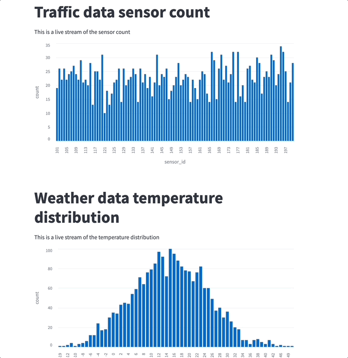

# Data Engineering: Realtime data processing with Apache Kafka and Faust Streaming
Welcome to the Data Engineer Repository, where you will find a real-time data stream application. The project is designed to demonstrate the use of modern tools and technologies to process and visualize real-time data. 
All components are containerized and can be deployed to a local machine. No cloud services are required.

## Prerequisites
The following are required to complete this project:

* Docker
* Python 3.10
* Access to a computer with a minimum of 16gb+ RAM and a 4-core CPU to execute the simulation

## Software Components
The following software components are part of the project:

* Apache Kafka: A distributed streaming platform that provides the ability to publish and subscribe to streams of records.

* Schema Registry: A component of Apache Kafka that provides a centralized repository for the storage and management of Avro schemas.

* PostgreSQL: An open-source relational database management system that is used to persist the data.

* Flask Framework in Python: A micro web framework for Python that is used to generate data for the stream.

* Faust framework: A Python library for building stream processing applications with Apache Kafka.

* Streamlit: An open-source app framework for Machine Learning and Data Science teams to create beautiful and performant apps in short time.

Our architecture will look like so:


## Microservice Architecture
The project is built using a microservice architecture, where each component is deployed as a separate service. The services are then connected and coordinated using Docker Compose, which allows you to define and run multi-container Docker applications.

## Running the Application
To run the application, you will need to have Docker and Docker Compose installed on your machine. Once you have those, you can use the following steps to get the application up and running:

### Clone the repository:
bash
Copy code
git clone https://github.com/your-username/data-engineer-repository.git
Change into the cloned directory:

``` bash
cd data-engineer-repository
```
Run the following command to start the services (Attention: the first execution may take a little longer, as all services have to be downloaded.):
    
``` bash
docker-compose up -d
```
This will start all the services defined in the docker-compose.yml file. You can then access the Streamlit app at http://localhost:8501 to visualize the data. 
If there is a failure in the dasboard, just refresh the page.

The dashboard will look like so:


### Test Postgresl Database
To test the connection and functionality of the sink connector between Kafka and PostgreSQL, you can connect to the PostgreSQL database using the following local configuration:
* Host: localhost
* Port: 5432
* Database: mydatabase
* User: myuser
* Password: mypassword

You can find these configurations in the docker-compose.yml file. Once you have connected to the database, you can use the following SQL statement to view the number of messages that have been uploaded to the database:
``` sql
SELECT COUNT(*) FROM "raw_traffic";
```

## Conclusion
That's it! You now have a working real-time data stream application that you can use to experiment and learn more about modern data engineering technologies. If you have any questions or feedback, feel free to reach out.

## Mentions
This project was inspired by the following projects. Check out the following resources to learn more about the technologies used in this project: 
* https://github.com/kyliepace/data_streaming_transport
* https://github.com/marcosschroh/faust-docker-compose-example
* https://github.com/DataTalksClub/data-engineering-zoomcamp